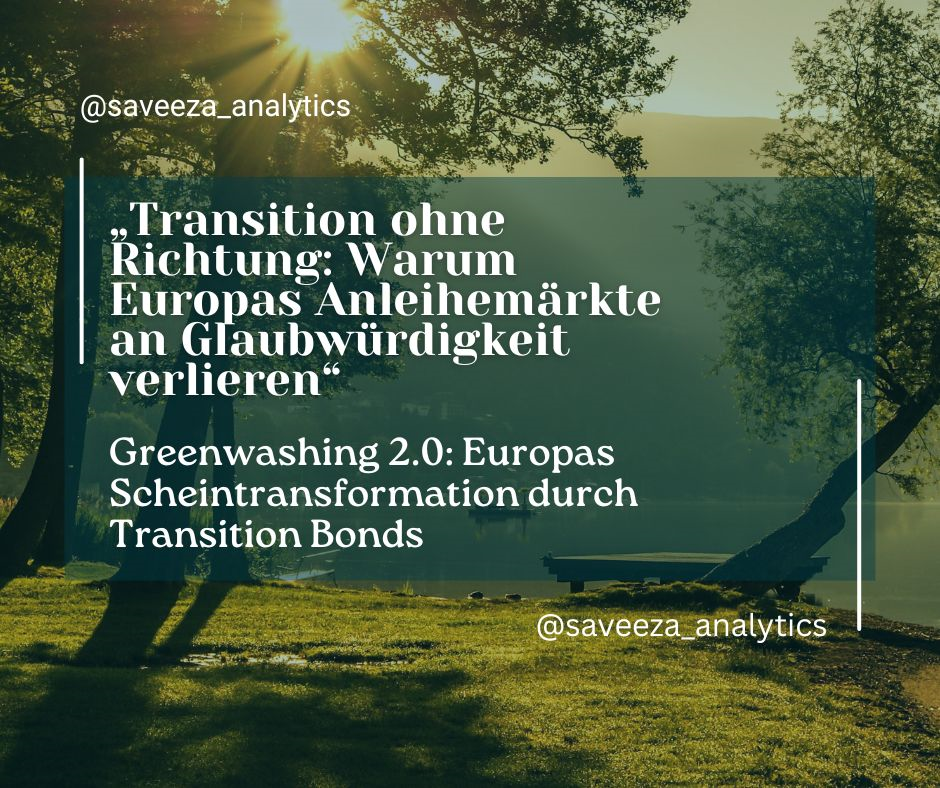
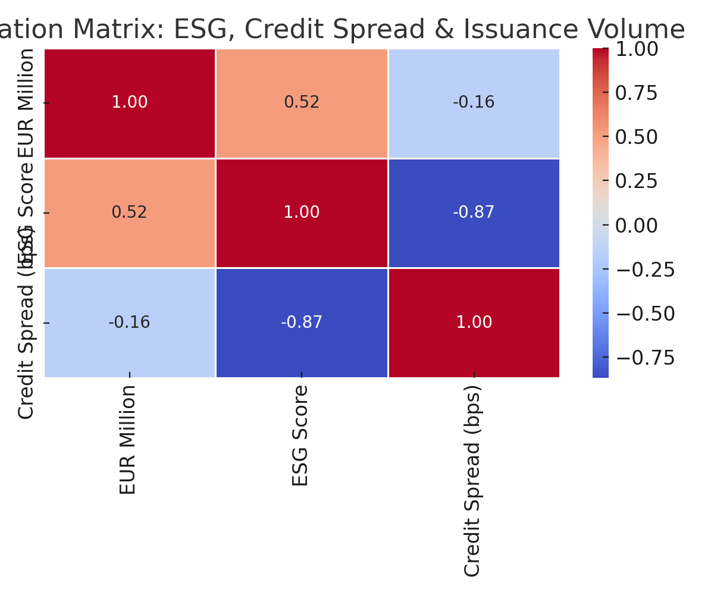
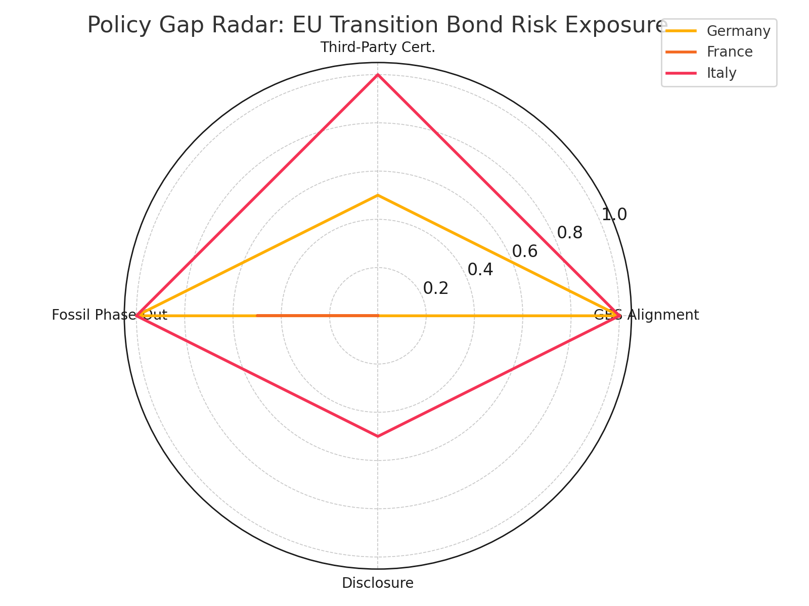

[](https://mybinder.org/v2/gh/Saveeza/transition-bonds-europe-gap-risk-data-policy-analysis/HEAD)

---


---


---

## 🇩🇪 Herkunft der Analyse

Diese Analyse basiert auf meinem deutschsprachigen Artikel:  
👉 [Greenwashed Promises und Transition Scams – Warum Europas Anleihenmärkte ein Glaubwürdigkeitsproblem haben](https://www.linkedin.com/pulse/greenwashed-promises-und-transition-scams-warum-saveeza-chaudhry--zx1xf)

> 📘 *Das Projekt ist auf Englisch dokumentiert, um international zugänglich und beruflich nutzbar zu sein.*  
> 📄 Eine deutsche PDF-Zusammenfassung ist unter [`/article/`](./article/) verfügbar.

---


# 📊 Transition Bonds Europe: Gap, Risk, Data & Policy Analysis

> **A professional research & data analytics project exploring credibility gaps, policy risk, and country-level exposure in European transition bonds.**  
> Combines data science, financial analysis, and ESG policy review to assess whether transition bonds drive real impact — or just greenwashing.

---


## 🧠 Key Technical Skills Demonstrated

- 📊 Advanced financial data analysis (issuance patterns, sector exposure)  
- 🧮 ESG & credit risk correlation modeling  
- 🗺 Gap & risk matrix building using real-world regulatory frameworks  
- 📈 Data visualization with Python (heatmaps, radar plots, bar charts)  
- 🏛 Deep dive into EU sustainable finance regulations (GBS, Taxonomy)  
- 🧰 Tools: pandas, seaborn, scikit-learn, plotly, Excel

---

## 📘 What’s Inside the Notebook

- 📥 **Loads** `transition_issuance.csv` and `policy_gap_matrix.csv`  
- 📊 **Correlation matrix** between ESG score, credit spreads & issuance volume  
- 🧠 **Country-level policy credibility review** (Germany, France, Italy)  
- 🕸 **Radar chart visualization** of EU policy gaps  
- ✅ **Conclusions & recommendations** for improving bond credibility

---

## 🖼️ Visuals

### ESG vs Credit Spread Correlation  


### Policy Gaps Radar Chart  


---

## 📂 Project Structure

```plaintext
📁 data/
    ├── transition_issuance.csv
    └── policy_gap_matrix.csv

📁 notebooks/
    └── transition_bond_analysis.ipynb

📁 visuals/
    ├── correlation_matrix.png
    └── policy_gaps_radar.png

📁 references/
    └── (to be added)
```
---

📄 Article/
    📌 Based on my article (in German):  
👉 [Greenwashed Promises und Transition Scams, Warum Europas Anleihemärkte an Glaubwürdigkeit verlieren (PDF)](article/Greenwashed%20Promises%20und%20Transition%20Scams,%20Warum%20Europas%20Anleihem%C3%A4rkte%20an%20Glaubw%C3%BCrdigkeit%20verlieren.pdf)


---

## 🔗 **Part of my ESG & transition bonds research series**

- 🌍 [From Greenwashing to Real Impact — Why Transition Bonds Matter](https://github.com/Saveeza/transition-bonds-impact-analysis)
- 🇪🇺 [Transition Bonds: The New Greenwashing?](https://www.linkedin.com/pulse/transition-bonds-new-greenwashing-how-europes-bond-market-chaudhry--sqdvf)

---

## 🙌 **Why this matters**
This analysis shows:
- How credibility gaps differ across European countries
- Where policy risk is highest
- Why data-driven insight is key to avoid greenwashing in sustainable finance

---

## 🚧 Project Status
✅ Repository created & structured  
✅ All data, visuals, and notebook finalized  
✅ Article PDF uploaded and linked  
✅ Banner added  
✅ README fully written  
📌 Project complete and published


---

📫 *Questions, feedback, or want the summary in German? Feel free to get in touch.*
